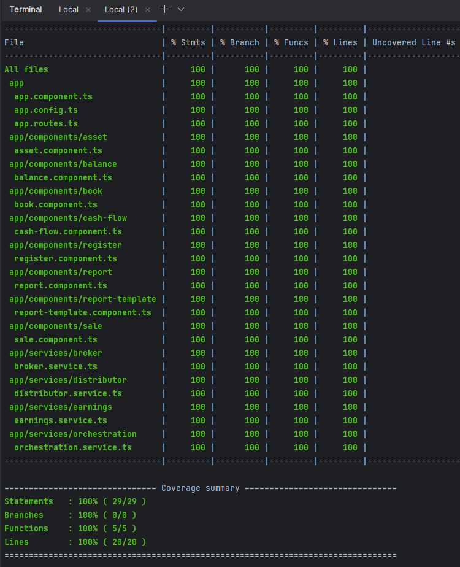
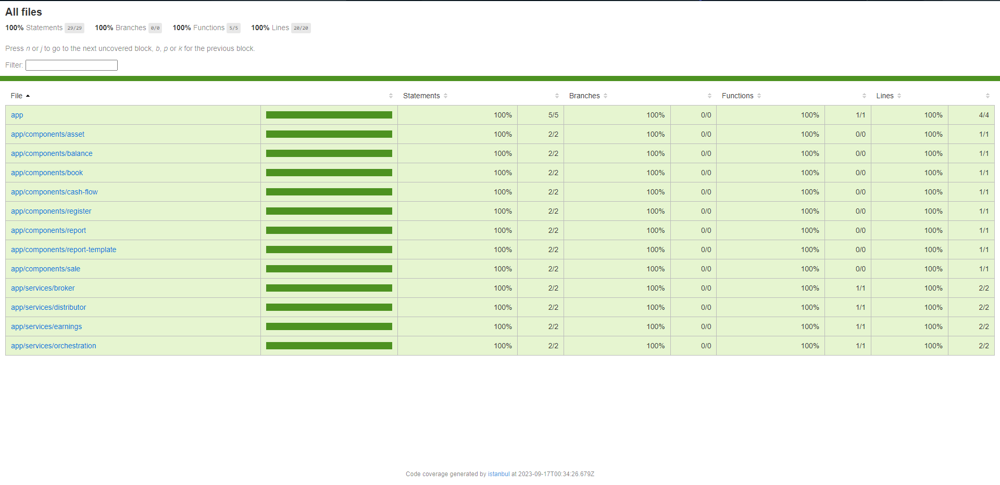

# Angular 16 - Cypress + Jest Code Coverage Setup

## Running unit tests

Run `npm run jest` to execute the unit tests.

## Running component tests

Run `npm run ct` to execute the cypress component tests in watch mode.\
Run `npm run ct:ci` to execute the cypress component tests in headless mode.

## Running e2e tests

Run `npm run e2e` to execute the cypress e2e tests in watch mode.\
Run `npm run e2e:ci` to execute the cypress e2e tests in headless mode.

## Running all tests

Run `npm run tests:all` to execute jest, component, and e2e tests as well as generating code coverage.

## Code scaffolding

Run `ng generate component components/component-name --standalone` to generate a new standalone component.\
Run `ng generate service services/service-name/service-name` to generate a new service.

Use these to populate coverage report with services and components.

## Code Coverage

Code coverage will appear in the `coverage` folder in a structure like:
- cypress-and-jest
  - coverage
    - .nyc_output
    - cypress
    - jest
    - merged-report

##### `.nyc_output` is the temporary directory where instrumented code output is placed.
##### `cypress` is the directory where the coverage information/reports are for component and e2e tests
##### `jest` is the directory where the coverage information/reports are for the jest/unit tests
##### `merged-report` is the directory where the combine information/reports of jest, component, and e2e tests

### Coverage commands
Run `npm run jest:coverage` to get the unit tests coverage report.\
Run `npm run cypress:coverage` to get the cypress tests (component and e2e) report.\
Run `npm run all:coverage` to get the combined report (jest and cypress).

### Examples

## Project Info

This project was generated with [Angular CLI](https://github.com/angular/angular-cli) version 16.2.1.

### Developers
- Jake Willmsen
